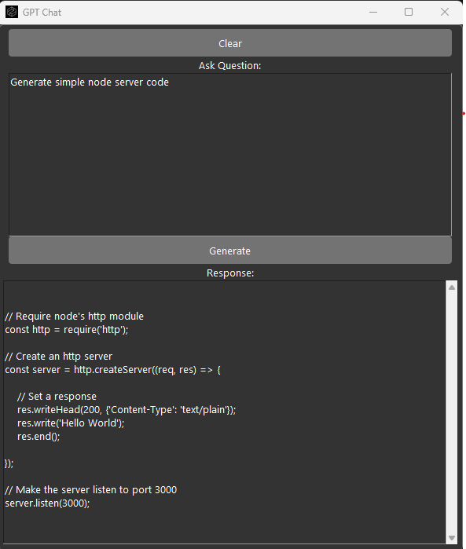

# Intiate python environment 
```
python -m venv venv 
```
# Activate environment 
```
venv\Scripts\activate
```
# Install Tkinter
```
pip install tk 
```
# Install openAI
```
pip install openai   
```


# How to use?

Create new key following steps at https://platform.openai.com/account/api-keys

## Run script

```
python app.py   
```

## API key request prompt
Enter generated key and save


# User interfase


